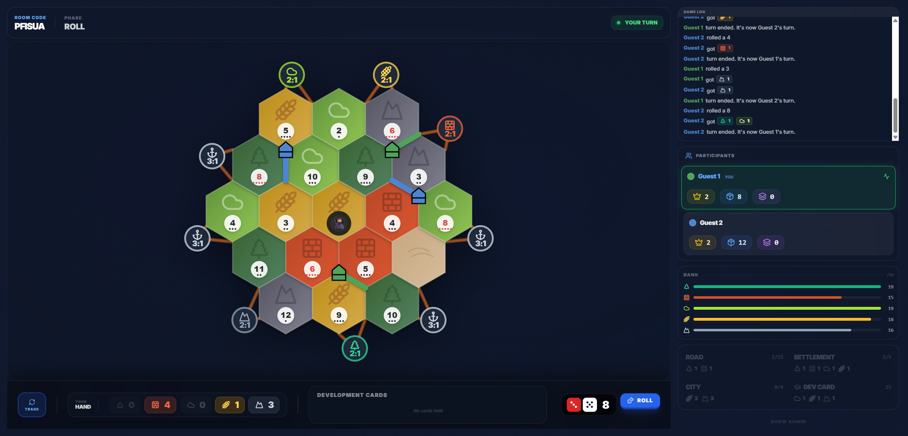

# Catan Clone

[](https://nextjs.org/)
[](https://reactjs.org/)
[](https://www.typescriptlang.org/)
[](https://tailwindcss.com/)
[](https://www.framer.com/motion/)
[](https://www.partykit.io/)

A real-time multiplayer Catan game supporting 3-8 players with an authoritative server, WebSocket state sync, and the full 5-6 / 7-8 player expansion.



## Features

### Core Engine
- **Server-authoritative game state** -- clients send intents, the server validates against game rules and broadcasts sanitized state. Each player only receives the information they're allowed to see (opponent hand sizes, not contents).
- **Immutable game logic** -- all state mutations are pure functions in `lib/game-logic/`, decoupled from the WebSocket transport. Makes the engine testable without a running server.
- **Phase-gated turn sequencing** -- strict Roll > Trade > Build flow with server-enforced phase transitions. Actions are rejected if sent in the wrong phase.
- **Predictive UI** -- valid build locations render as translucent previews before server confirmation, giving zero-latency feedback while the server remains the source of truth.

### 5-8 Player Expansion
- **Dynamic board generation** -- hexagonal grid scales from 19 hexes (base) to 30 hexes (5-6 player, trimmed radius-3) to 37 hexes (7-8 player, full radius-3) using axial coordinates. Terrain, number tokens, and harbors all scale proportionally.
- **Special Building Phase** -- after each player's turn, all other players get a clockwise opportunity to build and buy (but not trade or play dev cards). Server manages the phase as a state machine with auto-skip for disconnected players.
- **Scaled economy** -- bank resources, development card deck composition, and harbor counts adjust per expansion mode.

### Polish
- **Resource animations** -- Framer Motion particles fly from hexes to the scoreboard on dice rolls.
- **Interactive robber** -- discard modal with direct resource element interaction when a 7 is rolled.
- **Real-time game log** -- action stream with inline player/resource badges.
- **Responsive layout** -- mobile-first with compact mode for 6+ player scoreboards.

## Architecture

The client sends player actions over a persistent WebSocket. The server validates every action against the current game state, applies it if legal, then broadcasts the new state to all connected clients after stripping private information per player.


## Tech Stack

| Layer | Technology | Role |
|---|---|---|
| Frontend | **Next.js 14** (App Router) | Pages, routing, SSR shell |
| UI | **React 18** + **Tailwind CSS** | Component rendering, utility-first styling |
| State | **Zustand** | Lightweight client store, no boilerplate |
| Animation | **Framer Motion** | Resource flight particles, UI transitions |
| Realtime | **PartyKit** (server) + **PartySocket** (client) | WebSocket rooms with per-room state on Cloudflare Workers |
| Types | **TypeScript** (strict mode) | Discriminated unions for all game actions, full type coverage |
| Testing | **Jest** + **ts-jest** | 56 tests across game logic, board generation, and expansion mechanics |

## Testing

```bash
npm test
```

4 test suites covering:
- **Board generation** -- hex counts, terrain distribution, harbor placement, and number token properties for all 3 board sizes
- **Special Building Phase** -- entering/exiting the phase, turn order, action gating (blocks trades, dev card play, victory), disconnection handling
- **Action validation** -- build/buy legality, phase checks, turn enforcement
- **Game simulation** -- end-to-end action sequencing through the server handler

## Local Setup

```bash
# Install dependencies
npm install

# Copy environment config
cp .env.example .env.local

# Start frontend (port 3000)
npm run dev

# Start backend (port 1999) in a separate terminal
npx partykit dev
```

Navigate to `http://localhost:3000` to create a room.

## Deployment

**Frontend** -- import the repo in Vercel and set `NEXT_PUBLIC_PARTYKIT_HOST` to your PartyKit deployment URL.

**Backend:**
```bash
npx partykit login
npx partykit deploy
```
