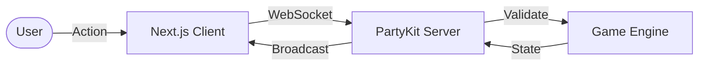

# Catan Clone

[](https://nextjs.org/)
[](https://reactjs.org/)
[](https://www.typescriptlang.org/)
[](https://tailwindcss.com/)
[](https://www.partykit.io/)

A professional implementation of the classic board game Catan, featuring real-time multiplayer, an authoritative server engine, and latency-compensating predictive UI.


## Tech Stack

- **Frontend**: Next.js, React, Tailwind CSS
- **Real-time**: PartyKit (Edge-native WebSockets)
- **State & Logic**: Immutable TypeScript engine with Zustand state management
- **Animations**: Physics-based micro-animations via Framer Motion

## Architecture

Built on an **Authoritative Server** pattern: the client sends user intents, while the server validates rules and broadcasts the official game state. High-performance latency masking is achieved through **Predictive UI** overlays.



## Features

- **Strategic Loop**: Full turn-based cycle including Rolling, Trading, and Building.
- **Engine Logic**: Automated resource distribution and server-side rule enforcement.
- **Multiplayer Interaction**: Real-time trading, development cards, and robber mechanics.
- **Live Observability**: Semantic event log providing real-time feedback with interactive UI badges.

## Project Structure

```text
├── app/                  # UI Pages & Layouts
├── components/           # React Components (Board, Game, UI)
├── lib/                  # Core logic, Utilities & Types
├── party/                # PartyKit server logic
├── public/               # Static assets
└── tests/                # Unit tests & Simulations
```

## How to Play

1. **Roll**: Get resources from bordering hexes.
2. **Trade**: Swap cards with the bank or other players.
3. **Build**: Expand using roads, settlements, and cities.
4. **Win**: First to 10 Victory Points wins.

## Local Setup

```bash
npm install
npm run dev             # Frontend (localhost:3000)
npx partykit dev        # Backend
```

## Deployment

### 1. Frontend (Vercel)
- Connect repository to Vercel.
- Set `NEXT_PUBLIC_PARTYKIT_HOST` to your PartyKit URL.

### 2. Backend (PartyKit)
```bash
npx partykit login
npx partykit deploy
```


