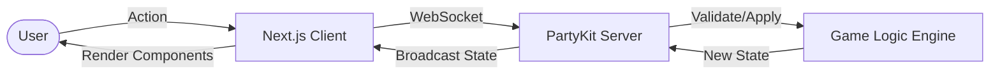

# Catan Clone

[](https://nextjs.org/)
[](https://reactjs.org/)
[](https://www.typescriptlang.org/)
[](https://tailwindcss.com/)
[](https://www.framer.com/motion/)
[](https://www.partykit.io/)

A real-time, web-based implementation of Catan. This project focuses on strict state synchronization, predictive UI feedback, and a maintainable game engine structure.

<!-- Replace this with a high-quality screenshot of your game board! -->


## Architecture

The system uses an authoritative server pattern where the client sends intents and the server broadcasts the validated state.



## Features

- **Authoritative Server**: Validates rules, resource constraints, and placement distances server-side.
- **Predictive Rendering**: Valid builds show translucent previews before socket confirmation for zero-latency feel.
- **Synchronized Game Loop**: Strict enforcement of Rolling → Trading → Building sequences.
- **Rich Event Logging**: Real-time event log parsing actions into interactive inline UI badges.
- **Robber Mechanics**: Interactive discard modal acting directly on resource elements.
- **Fluid Animations**: Framer Motion powered resource flights from hexes to the scoreboard.

## Project Structure

```text
├── app/                  # Next.js App Router (UI Pages & Layouts)
├── components/           # React Components (Board, Game, UI)
│   ├── board/            # SVG Hex board rendering logic
│   └── game/             # Game-specific UI (Scoreboard, Modals)
├── lib/                  # Shared Utilities & Logic
│   ├── game-logic/       # Core immutable game engine (Rules, Resource dist)
│   └── types.ts          # Central TypeScript interfaces
├── party/                # PartyKit authoritative server
├── public/               # Static assets
└── tests/                # Unit tests & Game simulations
```

## Local Setup

1. **Install dependencies:**
   ```bash
   npm install
   ```

2. **Start Next.js (Frontend):**
   ```bash
   npm run dev
   ```

3. **Start PartyKit (Backend):**
   ```bash
   npx partykit dev
   ```

Navigate to `http://localhost:3000` to start a session.

## Deployment

### 1. Deploy Frontend (Next.js)
- Import the repository in your **Vercel** dashboard.
- Set `NEXT_PUBLIC_PARTYKIT_HOST` to your deployed PartyKit URL.

### 2. Deploy Backend (PartyKit)
- `npx partykit login`
- `npx partykit deploy`

---
*Built with precision and passion for modern web gaming.*
